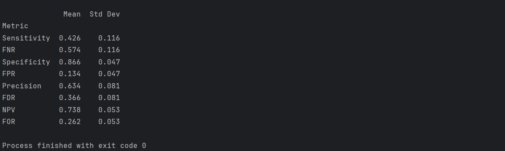

# NNmodel-ROC-diabetis-detection

--Accuracy: Calculated using a 0.5 threshold for my probabilities
--data has not being normalized

This is what my mean ROC curve looks like

Overfitting set in very early:

    I need to use regularization to deal with this

Using an MCCV, I achieved:

    Mean Accuracy: 0.761 ± 0.037

    Mean ROC Area under the curve: 0.812 ± 0.062

==== TESTING RESULTS ====

My testing results are somehow similar to validation indicating overfitting is minimized 

 1. achieved accuracy on this test is: 0.7337662577629089 

 
 2. achieved performance on this test is: 0.7865932047750229 

[11.0, 138.0, 74.0, 26.0, 144.0, 36.099998474121094, 0.5569999814033508, 50.0] => 1 (expected 1)

[3.0, 106.0, 72.0, 0.0, 0.0, 25.799999237060547, 0.2070000022649765, 27.0] => 0 (expected 0)

[6.0, 117.0, 96.0, 0.0, 0.0, 28.700000762939453, 0.15700000524520874, 30.0] => 0 (expected 0)

[2.0, 68.0, 62.0, 13.0, 15.0, 20.100000381469727, 0.25699999928474426, 23.0] => 0 (expected 0)

[9.0, 112.0, 82.0, 24.0, 0.0, 28.200000762939453, 1.281999945640564, 50.0] => 0 (expected 1)

[0.0, 119.0, 0.0, 0.0, 0.0, 32.400001525878906, 0.14100000262260437, 24.0] => 1 (expected 1)

[2.0, 112.0, 86.0, 42.0, 160.0, 38.400001525878906, 0.2460000067949295, 28.0] => 0 (expected 0)

[2.0, 92.0, 76.0, 20.0, 0.0, 24.200000762939453, 1.6979999542236328, 28.0] => 0 (expected 0)

[6.0, 183.0, 94.0, 0.0, 0.0, 40.79999923706055, 1.4609999656677246, 45.0] => 1 (expected 0)

[0.0, 94.0, 70.0, 27.0, 115.0, 43.5, 0.34700000286102295, 21.0] => 0 (expected 0)